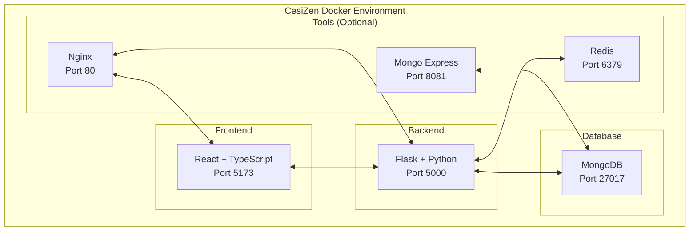

# 🐳 Guide de Déploiement Docker - CesiZen

Ce guide vous explique comment déployer et gérer l'application **CesiZen** avec Docker dans un environnement de développement.

## 📋 Table des matières

- [🎯 Prérequis](#-prérequis)
- [🚀 Installation rapide](#-installation-rapide)
- [🏗️ Architecture Docker](#️-architecture-docker)
- [⚙️ Configuration](#️-configuration)
- [🔧 Commandes principales](#-commandes-principales)
- [🔍 Surveillance et logs](#-surveillance-et-logs)
- [🧪 Tests et développement](#-tests-et-développement)
- [📊 Services optionnels](#-services-optionnels)
- [🛠️ Maintenance](#️-maintenance)
- [🐛 Dépannage](#-dépannage)
- [🔒 Sécurité](#-sécurité)

## 🎯 Prérequis

### Logiciels requis

- **Docker** 20.10+ ([Installation](https://docs.docker.com/get-docker/))
- **Docker Compose** 2.0+ (inclus avec Docker Desktop)
- **Git** pour cloner le repository

### Configuration système recommandée

- **RAM** : 4 GB minimum, 8 GB recommandé
- **CPU** : 2 cœurs minimum, 4 cœurs recommandé
- **Stockage** : 10 GB d'espace libre minimum
- **OS** : Windows 10/11, macOS 10.15+, ou Linux

### Vérification des prérequis

```bash
# Vérifier Docker
docker --version
docker compose version

# Vérifier que Docker fonctionne
docker run hello-world
```

## 🚀 Installation rapide

### 1️⃣ Cloner le repository

```bash
git clone https://github.com/votre-username/CesiZen.git
cd CesiZen
```

### 2️⃣ Configuration de l'environnement

```bash
# Copier le fichier d'environnement
cp docker.env.example .env

# Éditer les variables selon vos besoins (optionnel)
# Les valeurs par défaut fonctionnent pour le développement
```

### 3️⃣ Démarrage des services

**Linux/macOS :**
```bash
# Rendre le script exécutable
chmod +x scripts/docker-dev.sh

# Démarrer l'environnement
./scripts/docker-dev.sh start
```

**Windows :**
```powershell
# Exécuter le script PowerShell
.\scripts\docker-dev.ps1 start
```

### 4️⃣ Accéder à l'application

Une fois démarrée, l'application sera accessible aux adresses suivantes :

- **Frontend** : http://localhost:5173
- **Backend API** : http://localhost:5000
- **MongoDB** : mongodb://localhost:27017

## 🏗️ Architecture Docker

### Services principaux



### Containers et volumes

| Container | Image | Port | Volume | Description |
|-----------|-------|------|---------|-------------|
| `cesizen-frontend` | Node 18 Alpine | 5173 | Code source | Interface React |
| `cesizen-backend` | Python 3.11 Slim | 5000 | Code source + logs | API Flask |
| `cesizen-mongodb` | MongoDB 6.0 | 27017 | Base de données | Stockage des données |
| `cesizen-mongo-express` | Mongo Express | 8081 | - | Interface web MongoDB |
| `cesizen-redis` | Redis 7 Alpine | 6379 | Cache | Cache et sessions |
| `cesizen-nginx` | Nginx Alpine | 80 | Configuration | Reverse proxy |

## ⚙️ Configuration

### Variables d'environnement principales

```bash
# Copier et éditer le fichier de configuration
cp docker.env.example .env
```

**Configuration MongoDB :**
```bash
MONGO_ROOT_USERNAME=admin
MONGO_ROOT_PASSWORD=votre-mot-de-passe-securise
MONGO_DB_NAME=CesiZen
MONGO_PORT=27017
```

**Configuration Backend :**
```bash
BACKEND_PORT=5000
SECRET_KEY=votre-cle-secrete-tres-longue-et-securisee
JWT_EXPIRATION_DELTA=86400
```

**Configuration Frontend :**
```bash
FRONTEND_PORT=5173
FRONTEND_PREVIEW_PORT=4173
```

### Personnalisation des ports

Si vous avez des conflits de ports, modifiez ces variables dans `.env` :

```bash
# Ports alternatifs
FRONTEND_PORT=3000
BACKEND_PORT=8000
MONGO_PORT=27018
MONGO_EXPRESS_PORT=8082
```

## 🔧 Commandes principales

### Scripts de gestion

**Linux/macOS :**
```bash
./scripts/docker-dev.sh [COMMANDE] [OPTIONS]
```

**Windows :**
```powershell
.\scripts\docker-dev.ps1 [COMMANDE] [OPTIONS]
```

### Commandes essentielles

| Commande | Description | Exemple |
|----------|-------------|---------|
| `start` | Démarrer tous les services | `./docker-dev.sh start` |
| `stop` | Arrêter tous les services | `./docker-dev.sh stop` |
| `restart` | Redémarrer les services | `./docker-dev.sh restart` |
| `status` | Voir le statut des services | `./docker-dev.sh status` |
| `logs` | Afficher les logs | `./docker-dev.sh logs backend` |
| `shell` | Ouvrir un terminal dans un container | `./docker-dev.sh shell backend` |

### Commandes de développement

```bash
# Mode développement avec outils
./docker-dev.sh dev

# Lancer les tests
./docker-dev.sh test

# Vérifier le code (linting)
./docker-dev.sh lint

# Construire les images
./docker-dev.sh build

# Reconstruire sans cache
./docker-dev.sh rebuild
```

### Commandes Docker Compose manuelles

Si vous préférez utiliser Docker Compose directement :

```bash
# Démarrer
docker compose up -d

# Arrêter
docker compose down

# Voir les logs
docker compose logs -f

# Construire
docker compose build

# Voir le statut
docker compose ps
```

## 🔍 Surveillance et logs

### Voir les logs en temps réel

```bash
# Tous les services
./docker-dev.sh logs

# Service spécifique
./docker-dev.sh logs backend
./docker-dev.sh logs frontend
./docker-dev.sh logs mongodb

# Logs avec horodatage
docker compose logs -f -t
```

### Surveiller les ressources

```bash
# Utilisation des ressources
docker stats

# Espace disque utilisé
docker system df

# Détails des volumes
docker volume ls
docker volume inspect cesizen_mongodb_data
```

### Points de contrôle de santé

Tous les services incluent des health checks :

```bash
# Vérifier la santé des services
docker compose ps

# Détails d'un service
docker inspect cesizen-backend --format='{{.State.Health.Status}}'
```

## 🧪 Tests et développement

### Lancer les tests

```bash
# Tous les tests
./docker-dev.sh test

# Tests backend uniquement
docker compose exec backend python -m pytest -v

# Tests frontend uniquement
docker compose exec frontend pnpm test --run

# Tests avec couverture
docker compose exec backend python -m pytest --cov=.
docker compose exec frontend pnpm test --coverage
```

### Développement avec hot reload

```bash
# Démarrer en mode développement
./docker-dev.sh dev

# Les modifications sont automatiquement synchronisées
# Frontend : Hot Module Replacement (HMR) activé
# Backend : Redémarrage automatique avec Flask debug mode
```

### Accès aux shells

```bash
# Shell backend (Python)
./docker-dev.sh shell backend

# Shell frontend (Node.js)
./docker-dev.sh shell frontend

# MongoDB shell
./docker-dev.sh shell mongodb

# Ou directement avec docker compose
docker compose exec backend bash
docker compose exec frontend sh
docker compose exec mongodb mongosh
```

## 📊 Services optionnels

### Profils Docker Compose

Activez les services optionnels avec des profils :

```bash
# Démarrer avec Mongo Express
./docker-dev.sh tools
# ou
COMPOSE_PROFILES=tools docker compose up -d

# Démarrer avec Redis
./docker-dev.sh cache

# Démarrer avec Nginx
./docker-dev.sh proxy

# Plusieurs profils
COMPOSE_PROFILES=tools,cache docker compose up -d
```

### Mongo Express

Interface web pour MongoDB :

- **URL** : http://localhost:8081
- **Utilisateur** : admin (configuré dans `.env`)
- **Mot de passe** : cesizen-admin (configuré dans `.env`)

### Redis

Cache et stockage de sessions :

```bash
# Se connecter à Redis
docker compose exec redis redis-cli -a cesizen-redis-password

# Surveiller Redis
docker compose exec redis redis-cli -a cesizen-redis-password monitor
```

### Nginx

Reverse proxy pour la production :

```bash
# Configuration personnalisée
cp docker/nginx/nginx.conf.example docker/nginx/nginx.conf
# Éditer selon vos besoins

# Démarrer avec Nginx
./docker-dev.sh proxy
```

## 🛠️ Maintenance

### Nettoyage régulier

```bash
# Nettoyer les ressources non utilisées
./docker-dev.sh clean

# Nettoyage manuel
docker system prune -f
docker volume prune -f
docker image prune -f
```

### Sauvegarde et restauration

```bash
# Sauvegarder MongoDB
./docker-dev.sh backup

# Restaurer depuis une sauvegarde
docker compose exec -T mongodb mongorestore --archive < backup_file.archive

# Sauvegarder les volumes
docker run --rm -v cesizen_mongodb_data:/data -v $(pwd):/backup alpine tar czf /backup/mongodb_backup.tar.gz /data
```

### Mise à jour des dépendances

```bash
# Mettre à jour toutes les dépendances
./docker-dev.sh deps

# Manuel
docker compose exec backend pip install --upgrade -r requirements.txt
docker compose exec frontend pnpm update
```

### Réinitialisation complète

```bash
# ⚠️ ATTENTION : Supprime toutes les données !
./docker-dev.sh reset
```

## 🐛 Dépannage

### Problèmes courants

#### Port déjà utilisé

```bash
# Identifier le processus utilisant le port
lsof -i :5173  # Linux/macOS
netstat -ano | findstr :5173  # Windows

# Changer le port dans .env
FRONTEND_PORT=3000
```

#### Problèmes de permissions

```bash
# Linux : Ajouter votre utilisateur au groupe docker
sudo usermod -aG docker $USER
# Redémarrer la session

# Problèmes de volumes
sudo chown -R $USER:$USER ./
```

#### Images corrompues

```bash
# Reconstruire les images
./docker-dev.sh rebuild

# Supprimer et reconstruire complètement
docker compose down --rmi all
docker compose build --no-cache
```

#### Problèmes de réseau

```bash
# Recréer le réseau
docker network rm cesizen-network
docker compose up -d
```

### Diagnostics

```bash
# Vérifier la configuration
docker compose config

# Détails d'un container
docker inspect cesizen-backend

# Logs détaillés
docker compose logs --timestamps --details

# Utilisation des ressources
docker stats --no-stream
```

### Logs de débogage

```bash
# Activer le mode debug
export COMPOSE_LOG_LEVEL=DEBUG

# Logs détaillés Docker
export DOCKER_BUILDKIT_PROGRESS=plain
```

## 🔒 Sécurité

### Configuration sécurisée

1. **Changez les mots de passe par défaut** dans `.env`
2. **Utilisez des clés secrètes fortes** pour JWT
3. **Ne commitez jamais** le fichier `.env`
4. **Utilisez HTTPS** en production

### Variables sensibles

```bash
# Générer une clé secrète forte
python -c "import secrets; print(secrets.token_urlsafe(32))"

# Ou avec openssl
openssl rand -base64 32
```

### Bonnes pratiques

- **Utilisateurs non-root** dans les containers
- **Health checks** pour tous les services
- **Limitations de ressources** configurées
- **Volumes persistants** pour les données importantes
- **Réseaux isolés** pour les services

### Audit de sécurité

```bash
# Scanner les vulnérabilités des images
docker scan cesizen-backend
docker scan cesizen-frontend

# Vérifier les configurations
docker-bench-security  # Outil tiers
```

## 📚 Ressources supplémentaires

### Documentation

- [Docker Documentation](https://docs.docker.com/)
- [Docker Compose Reference](https://docs.docker.com/compose/)
- [MongoDB Docker](https://hub.docker.com/_/mongo)
- [Node.js Docker](https://hub.docker.com/_/node)
- [Python Docker](https://hub.docker.com/_/python)

### Outils utiles

- **Portainer** : Interface graphique Docker
- **Docker Desktop** : Interface native
- **Lazydocker** : TUI pour Docker
- **dive** : Analyser les images Docker

### Support

- **Issues GitHub** : Pour les bugs et feature requests
- **Documentation** : Guides détaillés dans `/docs`
- **Community** : Discord et forums

---

<div align="center">

**🐳 Happy Dockering with CesiZen! 🧘‍♀️**

*Pour plus d'aide, consultez la [documentation complète](./Documentation_CesiZen.md)*

</div> 