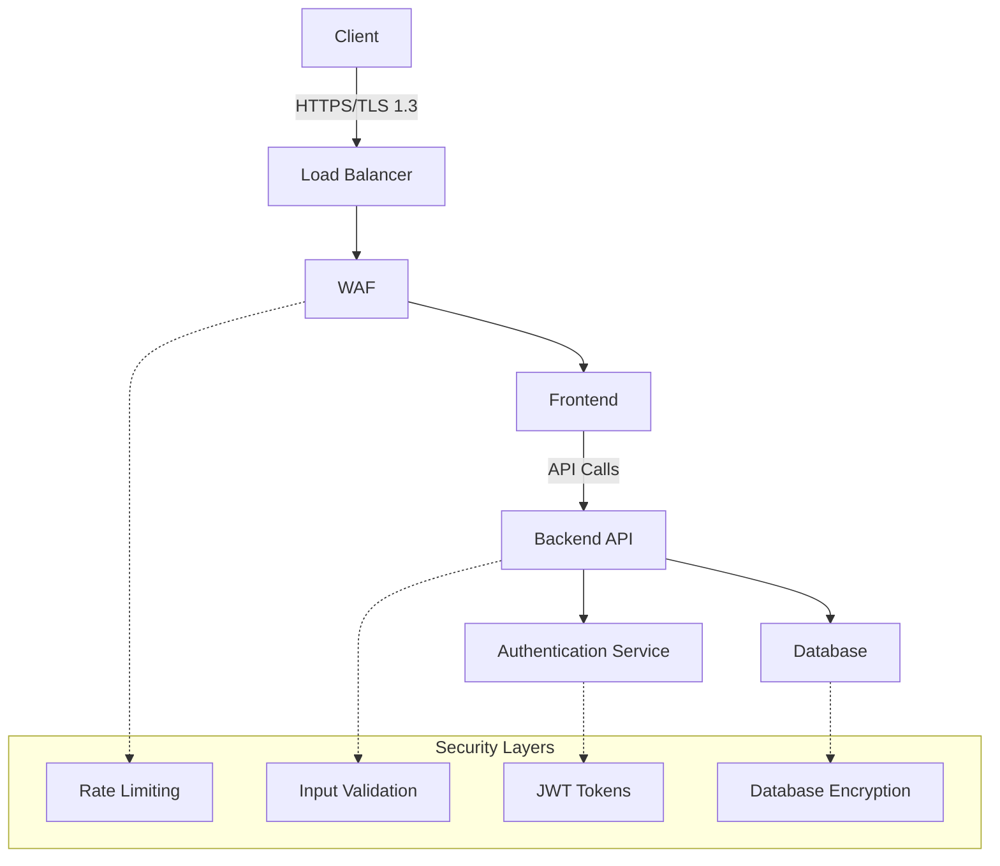

# 🔒 Politique de Sécurité - CesiZen

## 🎯 Notre engagement sécurité

La sécurité de **CesiZen** et de ses utilisateurs est notre priorité absolue. Nous prenons au sérieux tous les rapports de vulnérabilités de sécurité et nous nous engageons à les traiter rapidement et de manière responsable.

## 🔢 Versions supportées

Nous maintenons activement et fournissons des mises à jour de sécurité pour les versions suivantes :

| Version | Supportée          | Status           |
| ------- | ------------------ | ---------------- |
| 1.0.x   | ✅ **Supportée**   | Version stable   |
| 0.9.x   | ⚠️ **LTS**          | Support limité   |
| < 0.9   | ❌ **Non supportée** | Fin de vie      |

### Politique de support

- **Version stable** : Corrections de sécurité et bugs critiques
- **LTS (Long Term Support)** : Corrections de sécurité uniquement
- **Fin de vie** : Aucun support, mise à jour recommandée

## 🚨 Signaler une vulnérabilité

### 🔐 Signalement sécurisé

Si vous découvrez une vulnérabilité de sécurité, **ne la divulguez pas publiquement**. Utilisez plutôt notre processus de divulgation responsable :

#### Méthodes de contact sécurisées

1. **Email chiffré** : [security@cesizen.app](mailto:security@cesizen.app)
   - Clé PGP : [Télécharger la clé publique](https://cesizen.app/.well-known/pgp-key.asc)
   - Empreinte : `ABCD 1234 EFGH 5678 IJKL 9012 MNOP 3456 QRST 7890`

2. **Formulaire sécurisé** : https://cesizen.app/security-report
   - Chiffrement TLS 1.3
   - Accès authentifié
   - Notifications automatiques

3. **Bug bounty** : https://hackerone.com/cesizen (à venir)

#### Informations à inclure

Pour nous aider à comprendre et résoudre rapidement le problème, veuillez inclure :

```markdown
## 🔍 Description de la vulnérabilité

**Type** : [XSS, SQLi, CSRF, etc.]
**Gravité** : [Critique, Élevée, Moyenne, Faible]
**Composants affectés** : [Backend, Frontend, API, etc.]

## 🎯 Impact potentiel

- Confidentialité : [Élevé/Moyen/Faible]
- Intégrité : [Élevé/Moyen/Faible]
- Disponibilité : [Élevé/Moyen/Faible]

## 📋 Étapes de reproduction

1. [Étape détaillée 1]
2. [Étape détaillée 2]
3. [Résultat observé]

## 🔧 Proof of Concept

[Code, captures d'écran, ou démonstration]

## 💡 Recommandations de correction

[Vos suggestions si vous en avez]
```

## ⏱️ Processus de réponse

### Timeline de réponse

| Étape | Délai | Description |
|-------|-------|-------------|
| **Accusé de réception** | 24h | Confirmation de réception du rapport |
| **Évaluation initiale** | 72h | Classification et priorité |
| **Investigation** | 7-14 jours | Analyse approfondie |
| **Correction** | 30-90 jours | Développement et tests |
| **Divulgation** | Variable | Publication coordonnée |

### Niveaux de gravité

#### 🔴 **Critique** (CVSS 9.0-10.0)
- **Exemples** : RCE, injection SQL critique, contournement d'authentification
- **SLA** : Correction en 7 jours
- **Communication** : Notification immédiate aux utilisateurs

#### 🟠 **Élevée** (CVSS 7.0-8.9)
- **Exemples** : XSS stocké, exposition de données sensibles
- **SLA** : Correction en 30 jours
- **Communication** : Bulletin de sécurité

#### 🟡 **Moyenne** (CVSS 4.0-6.9)
- **Exemples** : CSRF, divulgation d'informations mineures
- **SLA** : Correction en 60 jours
- **Communication** : Notes de version

#### 🟢 **Faible** (CVSS 0.1-3.9)
- **Exemples** : Problèmes de configuration, vulnérabilités théoriques
- **SLA** : Correction en 90 jours
- **Communication** : Changelog

## 🛡️ Mesures de sécurité en place

### Architecture sécurisée



### Contrôles de sécurité

#### 🔐 **Authentification & Autorisation**
- JWT avec refresh tokens
- Hachage bcrypt (coût 12+)
- Politique de mots de passe robuste
- Sessions limitées dans le temps
- Contrôle d'accès basé sur les rôles (RBAC)

#### 🛡️ **Protection des données**
- Chiffrement en transit (TLS 1.3)
- Chiffrement au repos (AES-256)
- Anonymisation des données sensibles
- Politique de rétention des données
- Conformité RGPD

#### 🚫 **Protection contre les attaques**
- Protection CSRF (tokens)
- Validation stricte des entrées
- Échappement automatique (XSS)
- Rate limiting par IP/utilisateur
- Headers de sécurité (CSP, HSTS, etc.)

#### 📊 **Monitoring & Logging**
- Journalisation des accès et erreurs
- Détection d'anomalies
- Alertes automatiques
- Audit trails complets
- Monitoring en temps réel

## 🏆 Programme de reconnaissance

Nous reconnaissons et récompensons les chercheurs en sécurité qui nous aident à améliorer la sécurité de CesiZen.

### Types de récompenses

#### 🥇 **Hall of Fame**
- Reconnaissance publique (avec autorisation)
- Badge de contributeur sécurité
- Invitation aux événements privés

#### 💰 **Bug Bounty** (à venir)
- **Critique** : 500€ - 2000€
- **Élevée** : 200€ - 500€
- **Moyenne** : 50€ - 200€
- **Faible** : Reconnaissance publique

### Critères d'éligibilité

✅ **Éligible**
- Vulnérabilités reproductibles
- Impact réel sur la sécurité
- Rapport détaillé et constructif
- Respect de la divulgation responsable

❌ **Non éligible**
- Attaques par déni de service
- Vulnérabilités connues ou déjà signalées
- Ingénierie sociale
- Problèmes dans des dépendances tierces
- Accès physique requis

## 📋 Bonnes pratiques pour les utilisateurs

### 🔐 Sécurité des comptes

- **Mots de passe forts** : Minimum 12 caractères, complexité élevée
- **Authentification à deux facteurs** : Activée quand disponible
- **Sessions** : Déconnexion sur les appareils partagés
- **Vérification** : Contrôle régulier de l'activité du compte

### 🌐 Navigation sécurisée

- **HTTPS obligatoire** : Vérifier le cadenas dans le navigateur
- **Mise à jour** : Navigateur et extensions à jour
- **Extensions** : Utiliser uniquement des extensions de confiance
- **Réseau** : Éviter les WiFi publics non sécurisés

### 📱 Applications mobiles

- **Sources officielles** : Télécharger uniquement depuis les stores officiels
- **Permissions** : Réviser les autorisations d'application
- **Mise à jour** : Installer les mises à jour de sécurité
- **Verrouillage** : Utiliser le verrouillage biométrique/PIN

## 📞 Contact et support

### Équipe sécurité

- **Responsable sécurité** : [security-lead@cesizen.app](mailto:security-lead@cesizen.app)
- **Équipe technique** : [security-team@cesizen.app](mailto:security-team@cesizen.app)
- **Urgences** : [urgent-security@cesizen.app](mailto:urgent-security@cesizen.app)

### Ressources additionnelles

- **Centre de sécurité** : https://cesizen.app/security
- **Bulletins de sécurité** : https://cesizen.app/security/advisories
- **Status page** : https://status.cesizen.app
- **Documentation** : https://docs.cesizen.app/security

## 📚 Ressources et références

### Standards et frameworks

- **OWASP Top 10** : Vulnérabilités web courantes
- **NIST Cybersecurity Framework** : Gestion des risques
- **ISO 27001** : Système de management de la sécurité
- **SANS Top 25** : Erreurs de programmation dangereuses

### Outils recommandés

- **Analyse statique** : SonarQube, CodeQL
- **Analyse dynamique** : OWASP ZAP, Burp Suite
- **Dépendances** : npm audit, Safety (Python)
- **Infrastructure** : Nessus, OpenVAS

## 📝 Changelog sécurité

### Version 1.0.0 (Décembre 2024)
- ✅ Politique de sécurité initiale
- ✅ Processus de divulgation responsable
- ✅ Mesures de sécurité de base
- 🔄 Programme bug bounty en préparation

---

<div align="center">

**🔒 La sécurité est l'affaire de tous**

*Ensemble, construisons une plateforme sûre et fiable*

**Version 1.0 - Dernière mise à jour : Décembre 2024**

</div> 